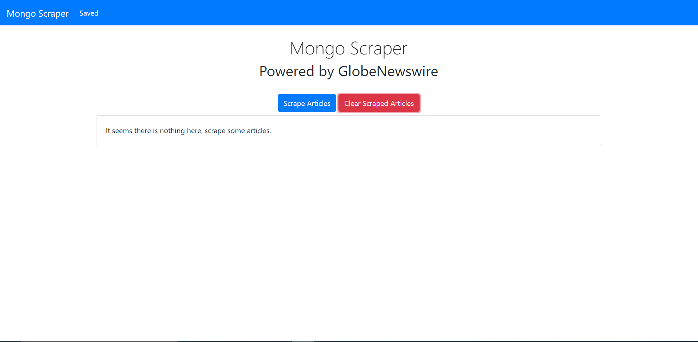
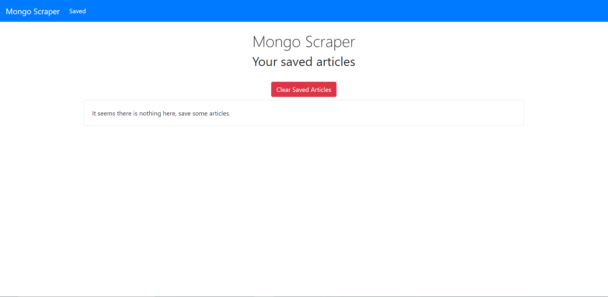

# MongoScraper

[See the app here!](https://mongoscraperbc.herokuapp.com/)

This app is a news article scraping app that grabs articles from GlobeNewswire and displays them on its page. The user can save the articles and view them on the saved articles page. Once there they can add notes to the saved articles.  This application is a NodeJS app that uses cheerio to scrape, MongoDB for data storage, and handlebars to display the pages.

## Index Page

The user can scrape articles for saving later here. They click the Scrape Articles button and the app will load the scraped articles. The user can then click the save button on the articles they want to saved to saved them.

## Saved Page

The user can view saved articles here. A note button will appear in the articles box that will display the notes the user has added for the article. The user can delete articles from their saved by clikcing the Delete button or clear all the articles with the Clear Saved Articles button.